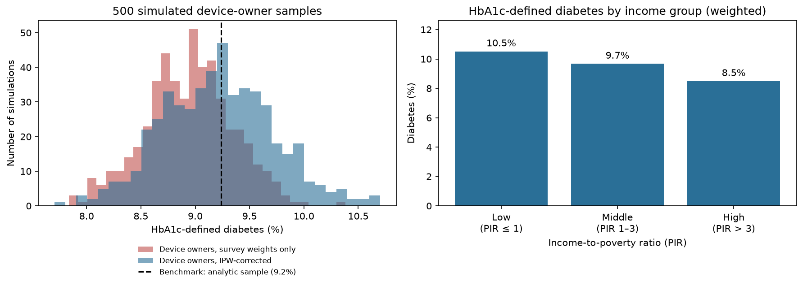

# Wearable Activity, HbA1c and Sampling Bias in NHANES 2013–2014

Analysis of wrist-worn accelerometer data from NHANES 2013–2014, looking at (1) whether daily activity is associated with HbA1c in adults, and (2) how much a sample skewed towards device owners biases a simple prevalence estimate, and whether inverse probability weighting corrects it.

The full analysis is in `nhanes_analysis.ipynb`.

## Data

Public data from the 2013–2014 cycle of the National Health and Nutrition Examination Survey (NHANES), CDC:

- [PAXDAY_H](https://wwwn.cdc.gov/Nchs/Data/Nhanes/Public/2013/DataFiles/PAXDAY_H.htm): physical activity monitor, day-level summaries
- [DEMO_H](https://wwwn.cdc.gov/Nchs/Data/Nhanes/Public/2013/DataFiles/DEMO_H.htm): demographics and sample weights
- [GHB_H](https://wwwn.cdc.gov/Nchs/Data/Nhanes/Public/2013/DataFiles/GHB_H.htm): glycohemoglobin (HbA1c)

Activity is measured in MIMS (Monitor-Independent Movement Summary), the movement unit NHANES uses for its wrist devices, summed over each day.

## Main results

Analytic sample: 4,214 adults aged 20+ with an HbA1c result and at least four valid days of wear (27,764 person-days).

| Model | Activity coefficient per 1,000 MIMS (95% CI) |
|---|---|
| Unadjusted | -0.044 (-0.053, -0.036) |
| Adjusted for age and sex | -0.015 (-0.024, -0.007) |
| Adjusted, survey-weighted | -0.020 (-0.030, -0.010) |

Most of the unadjusted association is explained by age. What remains is small: about 0.08–0.10 percentage points of HbA1c across the interquartile range of daily activity. In a mixed-effects model on the daily data, the ICC was 0.63, meaning most of the variation in daily activity is between people rather than from day to day. Activity was also about 5% lower at weekends. Results were essentially the same with a three-day minimum instead of four.

Among the 3,916 participants with income data, HbA1c-defined diabetes (≥ 6.5%) was 9.2% with survey weights and 11.4% without. In 500 simulated samples where the probability of owning a device rose with income (0.2 / 0.5 / 0.8), the survey-weighted estimate averaged 8.9%; with inverse probability weighting it averaged 9.2% (SD 0.5).

## Caveats

The data are cross-sectional, so these results show associations, not causes. Diabetes is defined by HbA1c alone, and the models do not adjust for BMI or diabetes medication. The survey-weighted regression approximates the NHANES survey design rather than using a full design-based analysis, and the mixed-effects model does not use survey weights. In the simulation, the device-ownership probabilities are assumptions, and inverse probability weighting works here because those probabilities are known exactly, which would rarely be true with real data. More detail is at the end of the notebook.

## Running the analysis

Requires Python 3 with pandas, numpy, statsmodels and matplotlib. Place the three .XPT files in the same folder as the notebook and run all cells.

## Contact

Juliet Uyo Ukwella · julietpaul32@gmail.com
